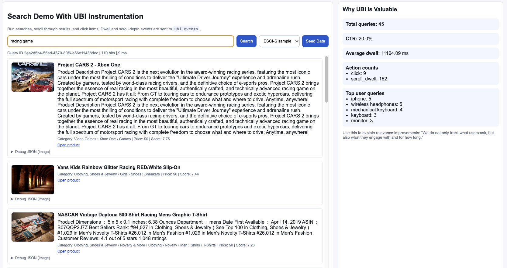
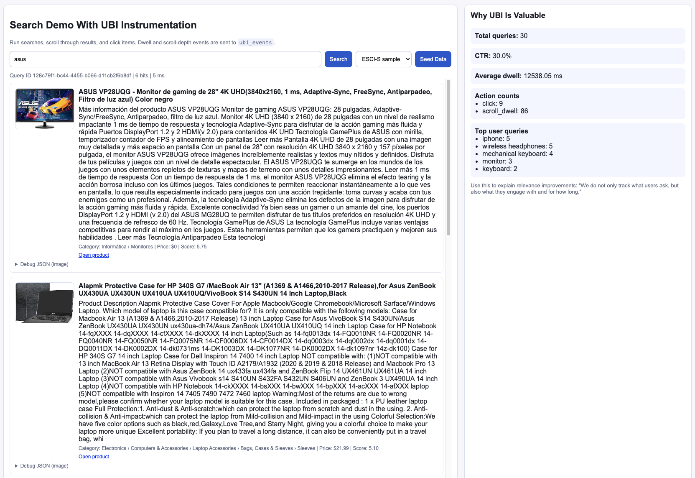
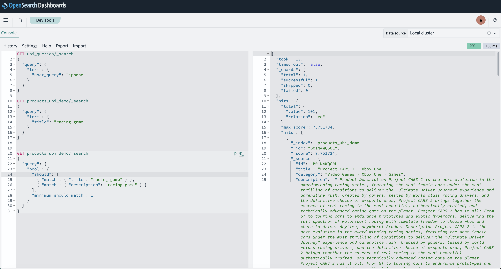
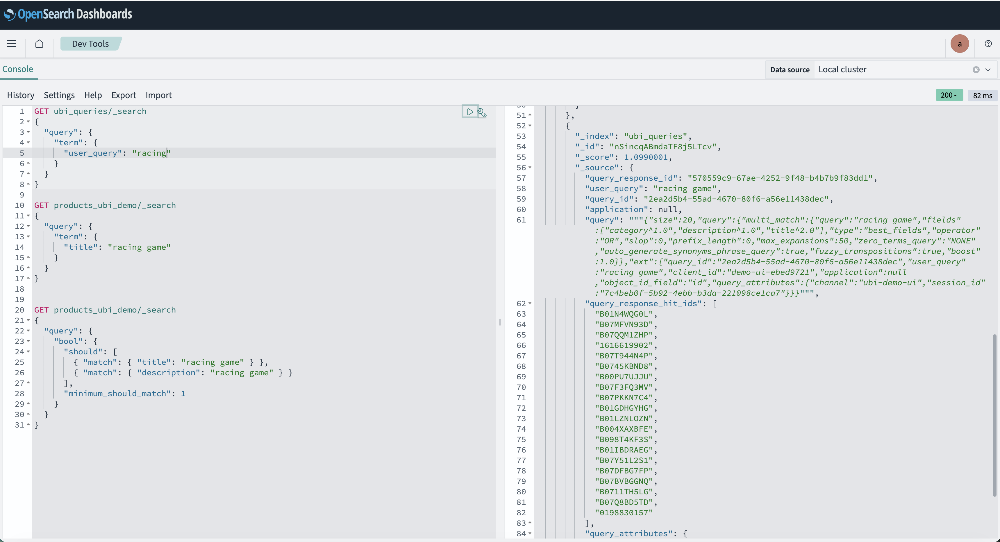
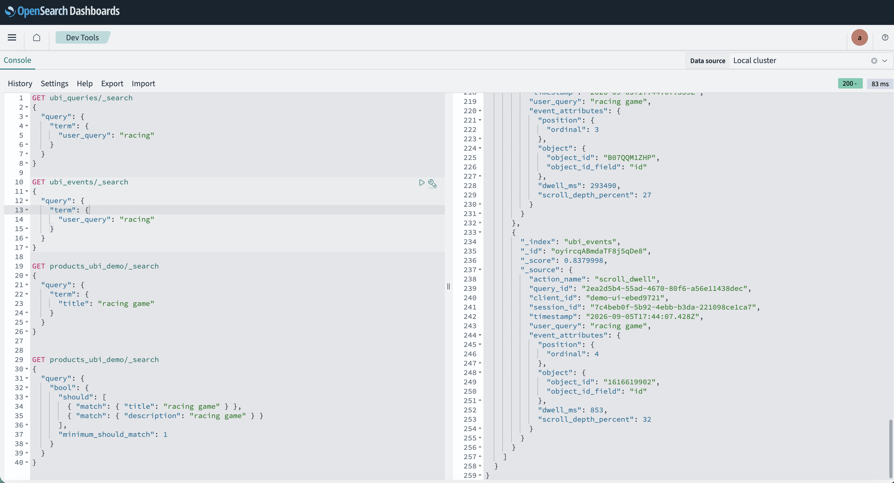

# Your users already know what's relevant. Are you listening?

**How User Behavior Insights on Aiven for OpenSearch® turns real search sessions into a feedback loop for better ranking**

---

If you work on search relevance, you know the feeling.

You ship a synonym. You boost a field. You add a vector model. You stare at a judgment set that was labeled six months ago and hope the next NDCG number moves in the right direction. Somewhere between offline metrics and production traffic, a quiet gap opens: **you optimized for what you think users want, not for what they actually do when the results appear.**

That gap is not a failure of effort. It is a missing feedback loop.

The good news? Your users are already generating the signal. Every query, every glance past a result, every click, every long dwell on the fourth hit — those are implicit judgments. They are noisy, imperfect, and more honest than almost any spreadsheet of graded labels you will ever assemble by hand.

OpenSearch® **User Behavior Insights (UBI)** exists to capture that signal in a structured way. On **Aiven for OpenSearch®**, the UBI plugin is available out of the box, so you can stop treating behavior as an afterthought and start treating it as first-class search data.

This post is for relevance engineers, product managers, and platform teams who want search that gets smarter because it listens.

## Relevance is a conversation, not a formula

Classic search improvement looks like a monologue: index → query → rank → ship → hope.

Great search is a conversation:

1. The user asks.
2. You answer with a ranked list.
3. The user responds — not with a survey, but with attention and action.
4. You learn, and you answer better next time.

Without step 3 persisted and joinable to step 1, you are flying on gut feel and delayed offline evaluation. With it, you can ask questions that actually change roadmaps:

- Which queries get results that nobody clicks?
- Which positions earn long dwell time but low CTR — maybe the title is wrong, not the product?
- Which result IDs repeatedly win attention for a head query — candidates for curated boosts or learning-to-rank labels?
- Where do users abandon after scrolling halfway — a ranking problem, or a SERP design problem?

UBI gives you the join key for that conversation: a shared **`query_id`** that links what was searched to what happened afterward.

## What UBI captures (and why the join matters)

UBI separates two kinds of truth that often get muddled in ad-hoc analytics:

| Index | What it stores | Why it matters |
| --- | --- | --- |
| **`ubi_queries`** | The user query, the executed DSL, session/client metadata, and the ordered hit IDs shown | Reconstructs *what the search engine decided* |
| **`ubi_events`** | Client-side actions — clicks, scroll dwell, depth — tied back to the same `query_id` | Reconstructs *what the human decided* |

Queries without events tell you about coverage and ranking output. Events without queries are anonymous clicks floating in a void. **Together**, they become relevance evidence.

On the search request, you opt in with an `ext.ubi` block. The plugin records the query side. Your UI (or the UBI JavaScript collector) posts events for the engagement side. Same `query_id`. Same story. Different chapters.

## A small demo with a big idea

We built a lightweight demo UI on Aiven for OpenSearch® to make that loop visible: seed product data (including a slice of the [ESCI-S](https://github.com/shuttie/esci-s) e-commerce corpus), search, scroll, click — and watch UBI metrics update while the same data lands in OpenSearch Dashboards.

The experience is intentionally simple. The point is not the chrome. The point is the closed loop.

### The UI: search, engage, measure

Here is a live session for `racing game` — results on the left, aggregated behavior on the right (query volume, CTR, average dwell, top queries):

And another session for `asus`, with real product imagery and the same metrics panel reminding you that relevance is not only “did we match tokens?” but “did anyone care?”:

That sidebar is deliberately blunt. It is the story you should be able to tell your stakeholders in one glance: *we do not only track what users ask — we track what they engage with, and for how long.*

### Behind the glass: products, queries, events

In OpenSearch Dashboards Dev Tools, the product catalog is ordinary and inspectable — titles, categories, descriptions in `products_ubi_demo`:

But the interesting part for relevance work is not only the catalog. It is the **audit trail of a single search**.

A document in `ubi_queries` for `racing game` carries the `query_id`, the user string, the multi-match DSL that ran, and the ordered list of hit IDs the UI actually showed:

Then, in `ubi_events`, the same `query_id` lights up with `scroll_dwell` actions — position, object id, dwell milliseconds, scroll depth:

Suddenly “improve relevance for racing game” stops being a vibe and becomes a dataset:

- Which ASINs were shown?
- Which ones earned dwell?
- Which ones were ignored at the top of the list?

That is the beginning of implicit judgments — the raw material for better boosts, better synonyms, better LTR labels, and better A/B hypotheses.

## What to do once you can see the loop

Instrumentation without action is just expensive logging. Once `ubi_queries` and `ubi_events` are flowing on Aiven for OpenSearch®, a practical relevance practice looks like this:

### 1. Find queries that fail quietly

High volume, low CTR, short dwell — or results shown and no events at all. These are your weekly triage list. Fix ten of these and users feel it more than a one-point offline metric bump nobody can explain.

### 2. Separate “wrong results” from “wrong presentation”

Long dwell on position 4 with no click on position 1 often means the right product is buried — or the top hit has a terrible title/image. Behavior helps you stop blaming the ranker for a content problem (and vice versa).

### 3. Turn winners into training signal

Repeated clicks and dwell on the same object IDs for a query family are soft labels. Use them to guide curated rules now, and learning-to-rank or re-ranking later. Your production traffic becomes a living judgment set.

### 4. Keep humans in the loop — with better questions

UBI does not replace expert judgment. It focuses it. Instead of “is this ranking good?”, ask “why do users skip these three IDs every time?” That is a question a merchant, catalog editor, or relevance engineer can answer in an afternoon.

## Why this matters more as search gets smarter

Vectors, hybrid retrieval, and generative answer experiences raise the ceiling of what search can do. They also raise the cost of being wrong in subtle ways. Semantic matches can look plausible and still miss intent. LLM-shaped results can sound confident and still fail the shopper.

**Behavior is the ground truth that survives every architecture fashion.** Whether you rank with BM25, k-NN, or a cross-encoder, users still click, still scroll, still leave. If you capture that with UBI on the same OpenSearch cluster that serves the query, your next model — whatever it is — has something real to learn from.

Aiven for OpenSearch® is built so you can focus on that product loop instead of operating the cluster: managed OpenSearch, Dashboards for exploration, and plugins like **User Behavior Insights** ready when you are.

## Start listening

You do not need a perfect measurement platform on day one. You need three things:

1. A `query_id` on every search.
2. Events that reuse it.
3. A habit of looking at the join every week.

From there, relevance stops being a monologue you deliver to users — and becomes a conversation they are already trying to have with you.

**Try it yourself**

- Explore the demo app and screenshots in the companion repo: [ubi-demo-ui](https://github.com/dimakan-dev/ubi-demo-ui)
- Read the OpenSearch docs on [User Behavior Insights](https://docs.opensearch.org/latest/search-plugins/ubi/)
- Spin up **[Aiven for OpenSearch®](https://aiven.io/opensearch)** and enable the UBI plugin from the [supported plugins list](https://aiven.io/docs/products/opensearch/reference/plugins)

Your users are already teaching you what relevant means.
The only question is whether your search stack is enrolled in the class.

---

*OpenSearch is a registered trademark of the OpenSearch Project. This article describes a demo application built on Aiven for OpenSearch® with the User Behavior Insights plugin.*
